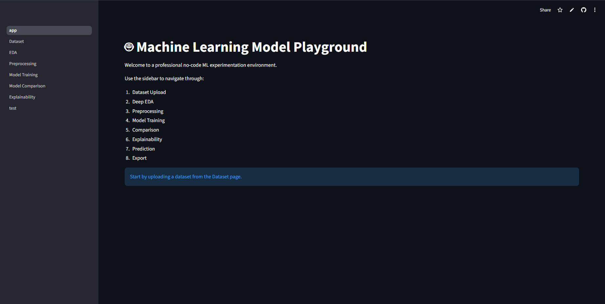
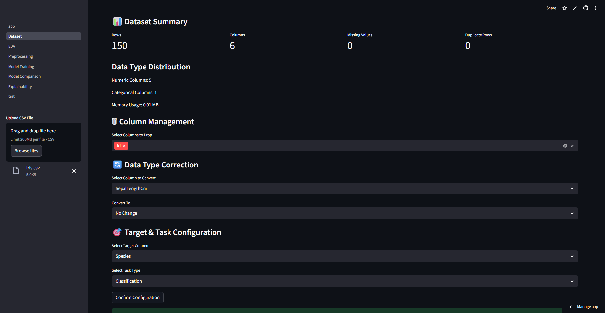
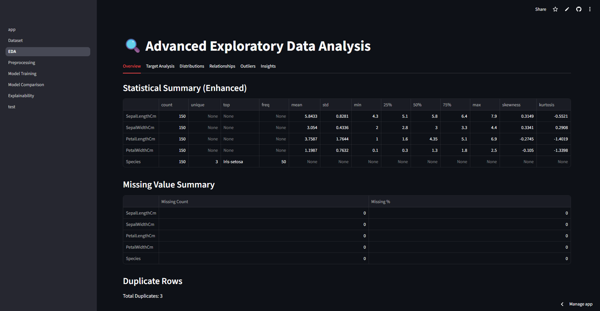
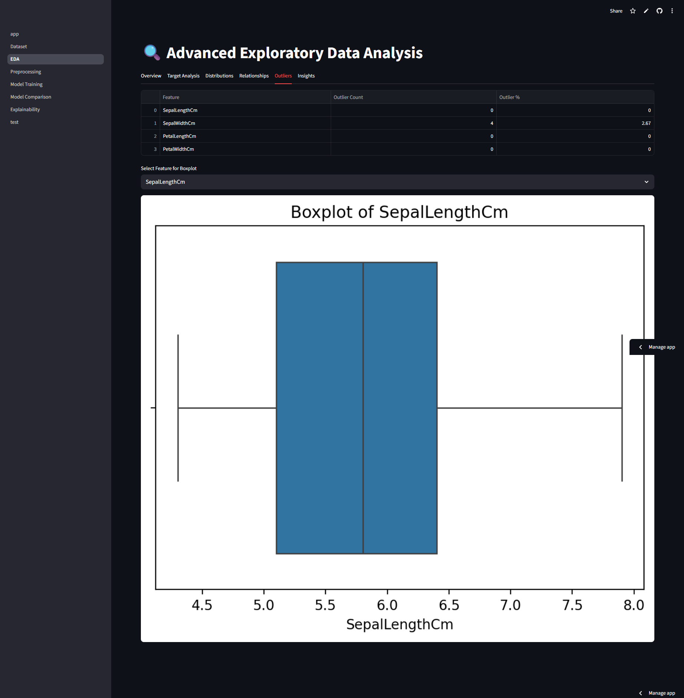
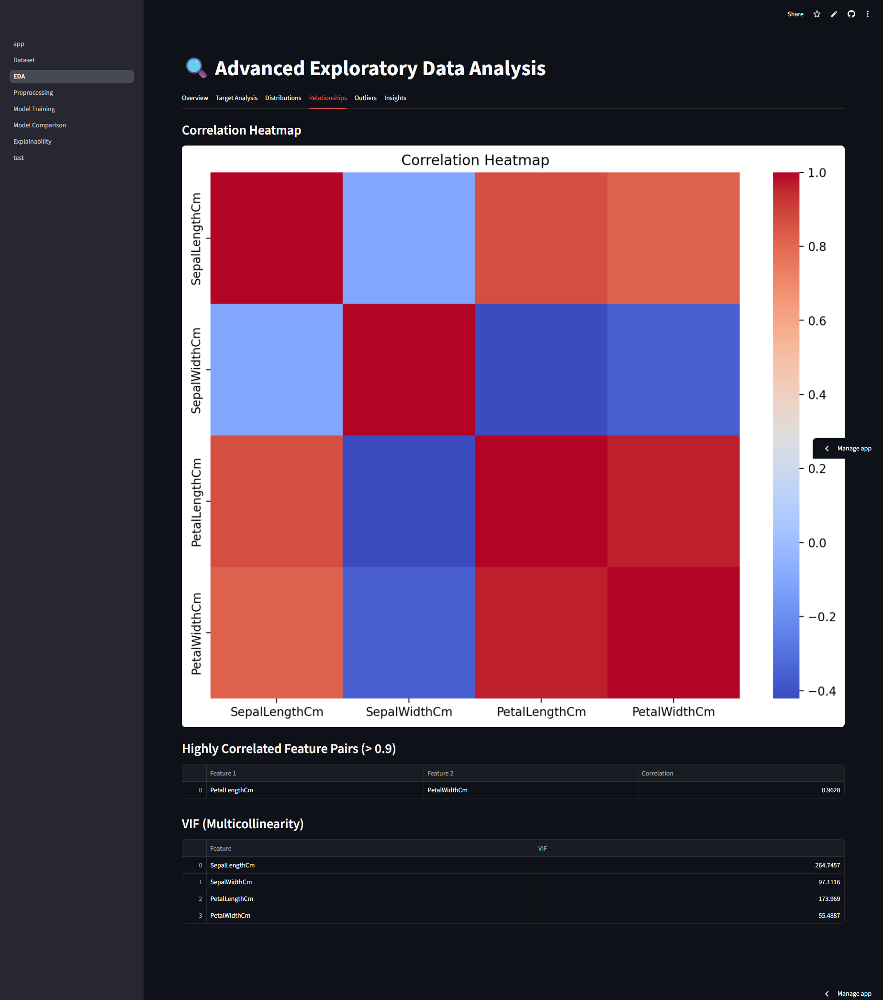
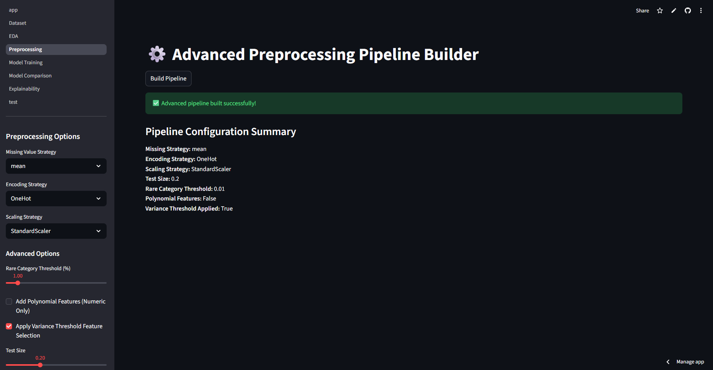
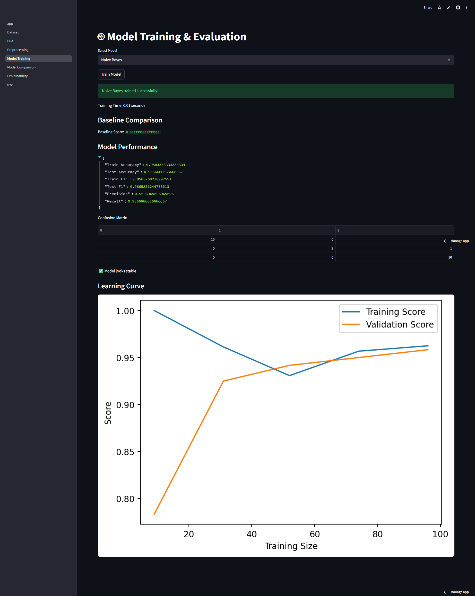
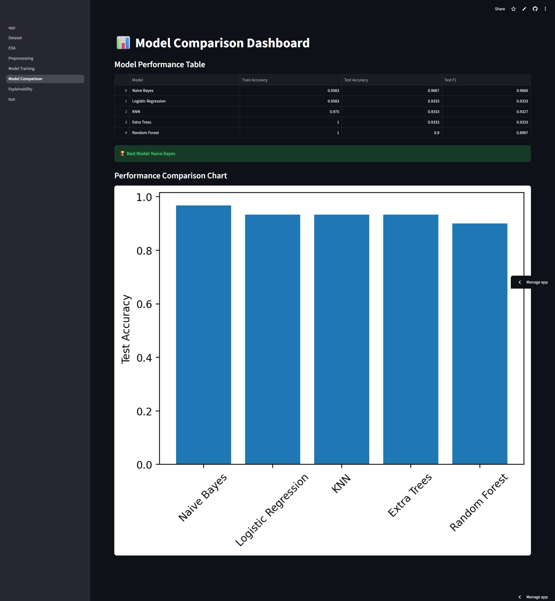

# 🧠 Machine Learning Model Playground


A **professional low-code Machine Learning experimentation
platform** built with **Streamlit**.\
This application allows users to upload datasets, perform deep EDA,
build advanced preprocessing pipelines, train and evaluate multiple ML
models, compare results, and understand model decisions using
explainability techniques. 

> 🎯 Designed as a **portfolio-grade ML system**, not a simple demo.
> Live Demo : https://machine-learning-model-playground.streamlit.app/
------------------------------------------------------------------------

## 📑 Table of Contents

-   [Overview](#-overview)
-   [Key Features](#-key-features)
-   [Screenshots](#-screenshots)
-   [Project Architecture](#-project-architecture)
-   [Supported Models](#-supported-models)
-   [Tech Stack](#-tech-stack)
-   [Installation](#-installation)
-   [Usage](#-usage)
-   [Deployment](#-deployment)
-   [Current Version](#-current-version)
-   [Future Roadmap](#-future-roadmap)
-   [License](#-license)

------------------------------------------------------------------------

## 🔍 Overview

Machine Learning Model Playground is an interactive web application that
enables users to:

-   Experiment with machine learning models without writing code
-   Apply industry-standard preprocessing pipelines
-   Detect overfitting and data leakage
-   Compare models using proper evaluation strategies
-   Interpret model predictions using explainability tools

------------------------------------------------------------------------

## ✨ Key Features

### 📂 Dataset Management

-   CSV upload & preview
-   Target variable selection
-   Classification / Regression detection
-   Manual column dropping
-   Data type correction
-   Missing values & duplicates summary

### 🔍 Advanced EDA

-   Descriptive statistics
-   Skewness & kurtosis analysis
-   Correlation matrix
-   Outlier detection (IQR-based)
-   Class imbalance detection

### ⚙️ Advanced Preprocessing Pipeline

-   Numeric & categorical handling
-   Scaling options
-   Encoding methods
-   Feature selection

### 🤖 Model Training & Evaluation

-   Multiple ML models
-   Train vs test evaluation
-   Overfitting detection
-   Confusion matrix & residual metrics

### 📊 Model Comparison Dashboard

-   Compare trained models
-   Rank by test performance
-   Visual performance charts

### 🧠 Model Explainability

-   Feature importance
-   SHAP summary plots
-   SHAP waterfall plots

------------------------------------------------------------------------

## 🖼 Screenshots

A visual walkthrough of the **Machine Learning Model Playground** built with Streamlit.

---

### 📊 Dashboard

<p align="center">
  
</p>

---

### 📂 Dataset Upload & Overview

<p align="center">
  
</p>

---

### 🔍 Exploratory Data Analysis (EDA)

<p align="center">
  
</p>

<p align="center">
  
</p>

<p align="center">
  
</p>

---

### ⚙️ Preprocessing Pipeline Builder

<p align="center">
  
</p>

---

### 🤖 Model Training & Evaluation

<p align="center">
  
</p>

---

### 📈 Model Comparison Dashboard

<p align="center">
  
</p>

---

------------------------------------------------------------------------

## 🧩 Project Architecture

ml_model_playground/ ├── app.py\
├── config.py\
├── requirements.txt\
├── README.md\
├── core/\
├── components/\
├── pages/\
└── models_store/

------------------------------------------------------------------------

## 🧪 Supported Models

### Classification

-   Logistic Regression
-   Random Forest
-   Gradient Boosting
-   Support Vector Machine
-   KNN
-   Decision Tree
-   Naive Bayes
-   Extra Trees

### Regression

-   Linear Regression
-   Ridge / Lasso
-   Random Forest Regressor
-   Gradient Boosting Regressor
-   SVR
-   KNN Regressor
-   Decision Tree Regressor
-   Extra Trees Regressor

------------------------------------------------------------------------

## 🛠 Tech Stack

-   Python
-   Streamlit
-   Pandas
-   NumPy
-   Scikit-Learn
-   Matplotlib
-   Seaborn
-   SHAP
-   Category Encoders
-   Statsmodels

------------------------------------------------------------------------

## 📦 Installation

``` bash
git clone https://github.com/your-username/ml-model-playground.git
cd ml-model-playground
python -m venv venv
source venv/bin/activate  # Windows: venv\Scripts\activate
pip install -r requirements.txt
streamlit run app.py
```

------------------------------------------------------------------------

## ▶️ Usage

1.  Upload a CSV dataset
2.  Select target column
3.  Perform EDA
4.  Build preprocessing pipeline
5.  Train models
6.  Compare results
7.  Analyze explainability

------------------------------------------------------------------------

## 🌐 Deployment

This app is Streamlit Cloud ready.

1.  Push project to GitHub
2.  Visit https://share.streamlit.io
3.  Select repository
4.  Set main file: app.py
5.  Click Deploy

------------------------------------------------------------------------

## 📌 Current Version

v1.0 -- Stable

------------------------------------------------------------------------

## 🔮 Future Roadmap

-   Hyperparameter tuning
-   Model export & download
-   Experiment tracking
-   NLP support
-   PDF report export
-   UI/UX enhancements

------------------------------------------------------------------------

